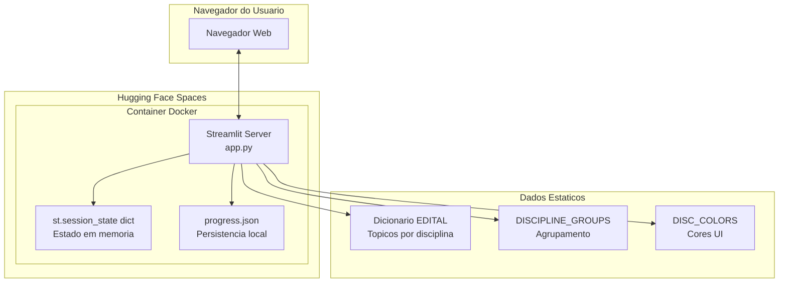

# Plano: Documento de Arquitetura (ARCHITECTURE.md)

## Contexto

Este plano define a criacao de um documento de arquitetura completo e detalhado para o **Dashboard de Estudos PMDF CFO 2025**, seguindo um template estruturado com 11 secoes. O projeto atual possui um documento de arquitetura minimalista (26 linhas) que precisa ser expandido.

**Arquivo alvo:** `docs/architecture.md` (sobrescrever o existente)

**Data de criacao:** 2026-03-06

---

## Objetivos do Trabalho

1. Substituir o `docs/architecture.md` atual por um documento completo seguindo o template de 11 secoes
2. Documentar fielmente a arquitetura atual (monolito Streamlit single-file)
3. Usar terminologia correta para arquitetura Streamlit
4. Ser honesto sobre a simplicidade do projeto (nao inventar complexidade)

---

## Estrutura do Template (11 Secoes)

### 1. Project Structure
- Descricao da estrutura de diretorios e arquivos
- Proposito de cada componente principal

### 2. High-Level System Diagram
- Diagrama Mermaid mostrando a arquitetura geral
- Fluxo de dados entre componentes

### 3. Core Components
- **Frontend:** Streamlit UI (sidebar, main area, componentes)
- **Backend:** Logica de negocio (funcoes em app.py)
- Separacao de responsabilidades

### 4. Data Stores
- `progress.json`: formato, localizacao, estrategia de persistencia
- Dicionarios em memoria (EDITAL, DISCIPLINE_GROUPS, DISC_COLORS)

### 5. External Integrations/APIs
- N/A (projeto nao possui integracoes externas)

### 6. Deployment & Infrastructure
- Hugging Face Spaces (Docker SDK)
- Dockerfile analisado
- Variaveis de ambiente

### 7. Security Considerations
- Autenticacao: N/A (app publico)
- Validacao de dados (progress.json)
- Tratamento de erros de I/O

### 8. Development & Testing Environment
- Python 3.11+
- Dependencias (requirements.txt)
- Ferramentas (uv, streamlit)
- Testes: N/A (nao implementado)

### 9. Future Considerations/Roadmap
- Possiveis evolucoes (multi-usuarios, banco de dados, etc.)
- Dividas tecnicas

### 10. Project Identification
- Nome, proposito, stack tecnologico
- Links relevantes

### 11. Glossary/Acronyms
- Termos especificos do dominio (PMDF, CFO, etc.)
- Termos tecnicos (Streamlit, session state, etc.)

---

## Conteúdo Específico por Seção

### Seção 1: Project Structure
```
/
├── app.py              # Single-file monolito (618 linhas)
├── progress.json       # Persistencia local (criado em runtime)
├── requirements.txt    # Dependencias (streamlit>=1.32.0)
├── Dockerfile          # Deploy Hugging Face Spaces
├── README.md           # Documentacao usuario
├── docs/
│   ├── architecture.md # Este documento
│   ├── contributing.md # Guias de contribuicao
│   └── plans/          # Historico de planejamento
├── .venv/              # Ambiente virtual (local dev)
└── .git/               # Controle de versao
```

**Nota para executor:** Usar `tree` ou `ls` para verificar estrutura atual.

### Seção 2: High-Level System Diagram


### Seção 3: Core Components

**Frontend (Streamlit UI):**
- `st.set_page_config()` - Configuracao da pagina
- `st.sidebar` - Barra lateral com filtros e navegacao
- `st.checkbox()` - Toggle de topico estudado
- `st.progress()` - Barra de progresso
- `st.metric()` - Cards de metricas
- `st.expander()` - Accordion para disciplinas

**Backend (Logica em app.py):**
- `resolve_progress_file()` - Resolve caminho do arquivo JSON
- `load_progress()` - Carrega estado persistido
- `save_progress()` - Persiste estado
- `calc_*_progress()` - Calculos de metricas
- `get_filtered_groups()` - Logica de filtragem
- `topic_matches_filter()` - Predicado de filtro

**Padrao de Arquitetura:**
- Single-file monolito (sem modularizacao)
- Renderizacao reativa via `st.rerun()`
- Estado gerenciado via `st.session_state`

**Nota:** Em Streamlit, "Frontend" e "Backend" sao conceituais. Todo o codigo executa no servidor; a UI e renderizada pelo framework via WebSocket.

### Seção 4: Data Stores

**progress.json:**
```json
{
  "Língua Portuguesa||1 Compreensão...": true,
  "Língua Portuguesa||2 Reconhecimento...": false,
  ...
}
```
- Formato: chave composta `disciplina||topico` -> boolean
- Localizacao: `/data/progress.json` (HF Spaces) ou `progress.json` (local)
- Fallback: `/tmp/progress.json` se write-only
- Backup automatico em caso de JSON invalido

**Dicionarios em memoria:**
- `EDITAL`: 16 disciplinas x ~400 topicos
- `DISCIPLINE_GROUPS`: 2 grupos (Conhecimentos Gerais / Especificos)
- `DISC_COLORS`: 16 cores hexadecimais para UI

### Seção 5: External Integrations/APIs
**Nao aplicavel** - O projeto e autocontido, sem chamadas a APIs externas.

### Seção 6: Deployment & Infrastructure

**Hugging Face Spaces (Docker SDK):**
- Base image: `python:3.11-slim`
- Porta: `7860` (padrao HF / variavel `PORT`)
- Usuario: `user` (UID 1000)
- Comando: `streamlit run app.py --server.port=${PORT} --server.address=0.0.0.0 --server.headless=true`

**Variaveis de Ambiente:**
- `PORT`: Porta HTTP (padrao: 7860) - ja utilizada no CMD
- `PROGRESS_FILE`: Caminho customizado para progress.json (opcional)

**Estrategia de Deploy:**
- Git push -> Hugging Face Space
- Rebuild automatico do container Docker
- Persistencia em volume montado em `/data/`

### Seção 7: Security Considerations

**Riscos Mitigados:**
- JSON invalido: backup automatico + estado limpo
- Write-only paths: tentativa de multiplos caminhos

**Limitacoes (dividas tecnicas):**
- Nao ha autenticacao/autorizacao
- Nao ha criptografia de dados em repouso
- Validacao de entrada: limitada a controles nativos do Streamlit (checkboxes/radio)
- Nao ha protecao contra CSRF/XSS (inerente ao Streamlit)

**Recomendacoes futuras:**
- Para multi-usuario: implementar autenticacao
- Para dados sensíveis: criptografar progress.json

### Seção 8: Development & Testing Environment

**Requisitos:**
- Python 3.11+
- `uv` (recomendado) ou `pip`

**Setup Local:**
```bash
uv sync
uv run streamlit run app.py
```

**Validacao:**
```bash
# Validacao de sintaxe minima via py_compile
uv run --no-project python -m py_compile app.py
```

**Testes:**
- Nao implementado (divida tecnica)

### Seção 9: Future Considerations/Roadmap

**Possiveis evolucoes:**
1. Modularizacao: separar UI de logica de negocio
2. Multi-usuario: autenticacao + progresso individual (exigiria mudanca de estrategia de persistencia)
3. Banco de dados: substituir JSON por SQLite/PostgreSQL
4. Testes: pytest + fixtures de estado
5. CI/CD: GitHub Actions para validar sintaxe
6. Internacionalizacao: suporte a multiplas linguas

**Dividas tecnicas atuais:**
- Single-file monolito dificulta manutencao
- Ausencia de testes automatizados
- Dados do edital hardcodados

### Seção 10: Project Identification

| Campo | Valor |
|-------|-------|
| Nome | PMDF CFO 2025 - Dashboard de Estudos |
| Proposito | Acompanhamento de progresso de estudos para concurso |
| Stack | Python 3.11, Streamlit 1.32+ |
| Licença | Uso educacional/pessoal |
| Repositorio | Git local (deploy via Hugging Face Spaces) |

### Seção 11: Glossary/Acronyms

| Termo | Definicao |
|-------|-----------|
| PMDF | Policia Militar do Distrito Federal |
| CFO | Curso de Formacao de Oficiais |
| Edital | Documento oficial do concurso com conteudo programatico |
| Streamlit | Framework Python para aplicacoes web interativas |
| session_state | Mecanismo de estado em memoria do Streamlit |
| rerun | Funcao para forcar re-renderizacao da UI |
| Hugging Face Spaces | Plataforma de hospedagem para aplicacoes ML/Python |

---

## Task Flow (Execucao)

1. **Preparacao**
   - Backup do arquivo atual: `cp docs/architecture.md docs/architecture.md.bak`
   - Verificar estrutura atual com `ls -la`

2. **Criacao do novo documento**
   - Criar novo `docs/architecture.md` com todas as 11 secoes
   - Seguir estritamente o conteudo especificado acima
   - Usar formato Markdown padrao

3. **Revisao**
   - Verificar se todas as 11 secoes estao presentes
   - Validar diagrama Mermaid (se houver visualizador)
   - Verificar links internos

4. **Limpeza**
   - Remover backup se aprovado: `rm docs/architecture.md.bak`

---

## Critérios de Aceite

- [ ] Arquivo `docs/architecture.md` criado/atualizado
- [ ] Todas as 11 secoes do template estao presentes
- [ ] Documento em portugues (pt-BR)
- [ ] Diagrama Mermaid incluido na secao 2
- [ ] Conteudo fiel ao codigo atual (sem inventar complexidade)
- [ ] Terminologia Streamlit correta (session_state, rerun, etc.)
- [ ] Links e referencias funcionais
- [ ] Formato Markdown valido

---

## Arquivos Envolvidos

| Arquivo | Acao | Descricao |
|---------|------|-----------|
| `docs/architecture.md` | **Sobrescrever** | Documento principal |
| `docs/architecture.md.bak` | Criar | Backup do atual (opcional) |

---

## Sucesso

Plano sera considerado bem-sucedido quando o novo `docs/architecture.md` estiver completo, com todas as 11 secoes preenchidas conforme especificado acima, pronto para revisao e aprovacao do usuario.
