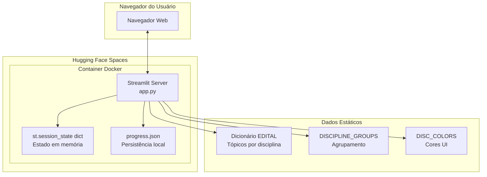

# Arquitetura - PMDF CFO 2025 | Dashboard de Estudos

Este documento descreve a arquitetura do **Dashboard de Estudos PMDF CFO 2025**, uma aplicação web para acompanhamento de progresso de estudos para concurso.

## 1. Estrutura do Projeto

```
/
├── app.py              # Monolito single-file (618 linhas) - UI, lógica de negócio e persistência
├── progress.json       # Persistência local (criado em runtime)
├── requirements.txt    # Dependências Python
├── pyproject.toml      # Configuração do projeto (uv)
├── Dockerfile          # Deploy no Hugging Face Spaces
├── README.md           # Documentação para usuários
├── CHANGELOG.md        # Histórico de mudanças
├── llms.txt            # Créditos de LLMs utilizados
├── docs/
│   ├── architecture.md # Este documento
│   ├── contributing.md # Guia de contribuição
│   └── plans/          # Histórico de planejamento
├── .venv/              # Ambiente virtual Python (desenvolvimento local)
└── .git/               # Controle de versão
```

**Propósito dos componentes principais:**

- **app.py**: Contém toda a lógica da aplicação: definição do edital, gerenciamento de estado, filtros, cálculos de progresso e interface Streamlit
- **progress.json**: Armazena o progresso de estudos do usuário (tópicos marcados como concluídos)
- **Dockerfile**: Configuração para deploy no Hugging Face Spaces via container Docker
- **docs/**: Documentação técnica e guias de contribuição

## 2. Diagrama de Alto Nível



**Fluxo de dados:**
1. Usuário acessa aplicação via navegador
2. Streamlit carrega `progress.json` e inicializa `st.session_state`
3. Interações do usuário (checkboxes, filtros) atualizam o estado
4. Alterações são persistidas em `progress.json`
5. Interface é re-renderizada via `st.rerun()`

## 3. Componentes Principais

### 3.1. Frontend (Interface Streamlit)

**Descrição:** Interface web interativa para acompanhamento de progresso de estudos, permitindo marcação de tópicos, filtragem por status/disciplina e visualização de métricas.

**Componentes UI:**
- `st.set_page_config()` - Configuração da página (título, ícone, layout)
- `st.sidebar` - Barra lateral com filtros, seleção de disciplina e métricas globais
- `st.checkbox()` - Toggle para marcar tópico como estudado
- `st.progress()` - Barra de progresso visual
- `st.metric()` - Cards de métricas (concluídos, total, percentual)
- `st.expander()` - Accordion para expandir/recolher disciplinas
- `st.radio()` - Seleção de modo de métricas e status

**Tecnologias:**
- Python 3.11+
- Streamlit 1.32+
- CSS customizado para estilização

**Deploy:**
- Hugging Face Spaces (Docker SDK)
- Porta: 7860

### 3.2. Backend (Lógica de Negócio)

**Descrição:** Funções em Python que implementam a lógica de negócio da aplicação, incluindo persistência, cálculos de progresso e filtragem de dados.

**Funções principais:**

| Função | Responsabilidade |
|--------|------------------|
| `resolve_progress_file()` | Resolve caminho gravável para `progress.json` (com fallbacks) |
| `load_progress()` | Carrega estado persistido do arquivo JSON |
| `save_progress()` | Persiste estado no arquivo JSON |
| `calc_discipline_progress()` | Calcula progresso por disciplina |
| `calc_overall_progress()` | Calcula progresso global |
| `calc_filtered_progress()` | Calcula progresso considerando filtros ativos |
| `get_filtered_groups()` | Retorna grupos/disciplinas filtrados |
| `topic_matches_filter()` | Predicado para verificar se tópico atende ao filtro |
| `init_ui_state()` | Inicializa variáveis de estado da UI |
| `get_topic_key()` | Gera chave composta para tópico |
| `main()` | Função principal que orquestra a aplicação |

**Tecnologias:**
- Python Standard Library (json, pathlib, os, datetime)
- Streamlit (st.session_state, st.rerun)

**Deploy:**
- Hugging Face Spaces (Docker)
- Processo único (sem workers/multiple instances)

**Nota:** Em Streamlit, "Frontend" e "Backend" são conceituais. Todo o código executa no servidor; a UI é renderizada pelo framework via WebSocket.

### 3.3. Dados Estáticos

**Dicionários em memória (hardcoded):**
- `EDITAL`: 15 disciplinas x ~246 tópicos do edital PMDF CFO 2025
- `DISCIPLINE_GROUPS`: 2 grupos (Conhecimentos Gerais / Específicos)
- `DISC_COLORS`: 15 cores hexadecimais para visualização

## 4. Armazenamento de Dados

### 4.1. progress.json

**Nome:** Arquivo de Progresso de Estudos

**Tipo:** Arquivo JSON local

**Propósito:** Persistir o progresso de estudos do usuário (tópicos marcados como concluídos)

**Localização (ordem de prioridade):**
1. Variável de ambiente `PROGRESS_FILE` (se definida)
2. `/data/progress.json` (Hugging Face Spaces com volume persistente)
3. `progress.json` (diretório atual)
4. `/tmp/progress.json` (fallback de último recurso)

**Formato:**
```json
{
  "Língua Portuguesa||1 Compreensão e interpretação de textos de gêneros variados": true,
  "Língua Portuguesa||2 Reconhecimento de tipos e gêneros textuais": false,
  "Direito Constitucional||1.1 Conceito, objeto, elementos e classificações da Constituição": true
}
```

**Estrutura da chave:** `{disciplina}||{tópico}` → `boolean`

**Estratégia de persistência:**
- Escrita imediata a cada alteração de checkbox
- Backup automático em caso de JSON inválido (arquivo renomeado com timestamp)
- Estado limpo inicializado em caso de erro de leitura

### 4.2. Dicionários em Memória

| Dicionário | Propósito | Tamanho |
|------------|-----------|---------|
| `EDITAL` | Conteúdo do edital (tópicos por disciplina) | 15 disciplinas x ~246 tópicos |
| `DISCIPLINE_GROUPS` | Agrupamento de disciplinas para UI | 2 grupos x 15 disciplinas |
| `DISC_COLORS` | Cores para visualização de disciplinas | 15 cores hexadecimais |

## 5. Integrações Externas / APIs

**Não aplicável** - O projeto é autocontido, sem chamadas a APIs ou serviços externos.

## 6. Deploy & Infraestrutura

### Cloud Provider
- **Hugging Face Spaces** - Plataforma de hospedagem para aplicações ML/Python

### Key Services Used
- **Docker Containers** - Runtime isolado
- **Volumes Persistentes** - Montagem em `/data` para persistência

### CI/CD Pipeline
- Deploy manual via Git push para repositório Hugging Face
- Rebuild automático do container Docker

### Monitoring & Logging
- Logs do container Hugging Face (via interface web)
- Sem monitoramento estruturado configurado

### Dockerfile

**Base Image:** `python:3.11-slim`

**Porta:** 7860 (padrão Hugging Face / variável `PORT`)

**Comando:**
```dockerfile
CMD ["streamlit", "run", "app.py", \
     "--server.port=${PORT}", \
     "--server.address=0.0.0.0", \
     "--server.headless=true"]
```

**Variáveis de Ambiente:**
- `PORT`: Porta HTTP (padrão: 7860) - já utilizada no CMD
- `PROGRESS_FILE`: Caminho customizado para progress.json (opcional)

## 7. Considerações de Segurança

### Autenticação
**Não implementado** - Aplicação pública sem controle de acesso

### Autorização
**Não aplicável** - Sem autenticação, portanto sem autorização

### Criptografia de Dados
- **Em trânsito:** TLS (fornecido pelo Hugging Face)
- **Em repouso:** Não implementada (progress.json em texto plano)

### Validação de Entrada
**Limitada a controles nativos do Streamlit** (checkboxes retornam booleanos, radio buttons retornam opções pré-definidas)

### Tratamento de Erros
- JSON inválido: backup automático + estado limpo
- Caminhos write-only: tentativa de múltiplos fallbacks
- I/O errors: capturados com try/except em `load_progress()`

### Limitações (Dívidas Técnicas)
- Não há autenticação/autorização
- Não há criptografia de dados em repouso
- Não há proteção contra CSRF/XSS (inerente ao Streamlit)
- Não há auditoria de ações

### Recomendações Futuras
- Para multi-usuario: implementar autenticacao
- Para dados sensíveis: criptografar progress.json

## 8. Ambiente de Desenvolvimento & Testes

### Setup Local

**Requisitos:**
- Python 3.11+
- `uv` (recomendado) ou `pip`

**Instalação:**
```bash
uv sync
# ou
pip install -r requirements.txt
```

**Execução:**
```bash
uv run streamlit run app.py
# ou
streamlit run app.py
```

### Validação de Sintaxe
```bash
uv run --no-project python -m py_compile app.py
```

### Frameworks de Teste
**Não implementado** - Ausência de testes automatizados (dívida técnica)

### Ferramentas de Qualidade de Código
- Validação de sintaxe via `py_compile`
- PEP 8 não aplicado formalmente

## 9. Considerações Futuras / Roadmap

### Possíveis Evoluções

1. **Modularização:** Separar UI de lógica de negócio (módulos Python)
2. **Multi-usuario:** Autenticação + progresso individual (exigiria mudança de estratégia de persistência)
3. **Banco de Dados:** Substituir JSON por SQLite ou PostgreSQL
4. **Testes:** Implementar pytest com fixtures de estado
5. **CI/CD:** GitHub Actions para validar sintaxe e rodar testes
6. **Internacionalização:** Suporte a múltiplas línguas (i18n)
7. **Edital externo:** Carregar edital de arquivo/config externa (não hardcoded)

### Dívidas Técnicas Atuais

- Single-file monolito dificulta manutenção
- Ausência de testes automatizados
- Dados do edital hardcoded no código
- Não há tipagem estática (type hints)
- Não há linting configurado

## 10. Identificação do Projeto

| Campo | Valor |
|-------|-------|
| **Nome** | PMDF CFO 2025 - Dashboard de Estudos |
| **Propósito** | Acompanhamento de progresso de estudos para concurso |
| **Stack** | Python 3.11+, Streamlit 1.32+ |
| **Licença** | Uso educacional/pessoal |
| **Repositório** | Git local (deploy via Hugging Face Spaces) |
| **Data da Última Atualização** | 2026-03-06 |

## 11. Glossário / Acrônimos

| Termo | Definição |
|-------|-----------|
| **PMDF** | Polícia Militar do Distrito Federal |
| **CFO** | Curso de Formação de Oficiais |
| **Edital** | Documento oficial do concurso com conteúdo programático |
| **Streamlit** | Framework Python para aplicações web interativas |
| **st.session_state** | Mecanismo de estado em memória do Streamlit para persistir dados entre re-renderizações |
| **st.rerun()** | Função para forçar re-renderização da UI (recarregamento da página) |
| **Hugging Face Spaces** | Plataforma de hospedagem para aplicações de ML/Python |
| **Monolito** | Aplicação single-file sem modularização |
| **JSON** | JavaScript Object Notation - formato de intercâmbio de dados |
| **Docker** | Plataforma de containerização para aplicações |
| **uv** | Gerenciador de pacotes Python rápido (alternativa ao pip) |
